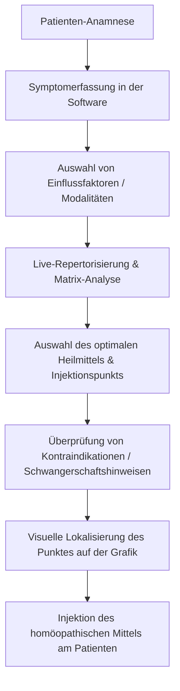

# Similapunktur & Homöosiniatrie Interaktiver Leitfaden
## Fachliche Grundlagen, Software-Anwendungsfälle und Systemanalyse für den Deep Research Agenten

Dieses Dokument beschreibt ausführlich den Anwendungsfall, die fachlichen Hintergründe sowie die Software-Architektur des interaktiven Similapunktur-Leitfadens. Es dient als strukturierte Grundlage für einen **KI Deep Research Agenten**, um Schwachstellen aufzudecken, Optimierungspotenziale in der klinischen Logik zu analysieren und Vorschläge für zukünftige Entwicklungsphasen zu erarbeiten.

---

## 1. Fachlicher und Medizinischer Kontext

### Was ist Similapunktur (Homöosiniatrie)?
Die **Similapunktur** (in der Fachliteratur häufig als **Homöosiniatrie** bezeichnet, begründet durch den französischen Arzt Roger de la Fuye in den 1930er/50er Jahren) stellt eine Synthese aus zwei etablierten komplementärmedizinischen Therapiesystemen dar:
1. **Traditionelle Chinesische Medizin (TCM) / Akupunktur:** Nutzung der topografischen Punkte auf den Meridianen (Leitbahnen) des menschlichen Körpers zur Regulation des Energieflusses (Qi).
2. **Klassische Homöopathie (nach Samuel Hahnemann):** Auswahl von potenzierten Arzneimitteln nach dem Ähnlichkeitsprinzip (*Similia similibus curentur* – Ähnliches werde durch Ähnliches geheilt).

### Das therapeutische Prinzip
Bei der klassischen Akupunktur wird ein mechanischer Nadelreiz gesetzt. Bei der klassischen Homöopathie wird ein Mittel oral verabreicht. 
In der **Similapunktur** werden beide Verfahren kombiniert: Ein homöopathisches Einzelmittel (in flüssiger Ampullenform) wird mittels feinster Nadeln direkt **intrakutan oder subkutan als Quaddel in den entsprechenden Akupunkturpunkt injiziert**.

Daraus ergibt sich ein synergistischer Doppel-Effekt:
* **Mechanischer Depot-Reiz:** Die injizierte Flüssigkeit bildet ein kleines Depot im Gewebe. Dieses Depot übt über mehrere Stunden (oft bis zu 12 Stunden) einen sanften, kontinuierlichen Druckreiz auf den Akupunkturpunkt aus (ähnlich einer Dauerakupunktur).
* **Biophysikalische Resonanz:** Das homöopathische Arzneimittel diffundiert in das Gewebe. Da der ausgewählte Akupunkturpunkt und das homöopathische Mittel die gleiche Symptomcharakteristik aufweisen, kommt es zu einer lokalen und systemischen Resonanz, die die Heilwirkung verstärkt.

### Die historische Verbindung: Weihesche Druckpunkte
Der deutsche Arzt August Weihe (1840–1896) entdeckte rein empirisch, dass bestimmte Punkte auf der Körperoberfläche bei Erkrankungen druckempfindlich (dolent) werden. Er kartierte ca. 195 bis 270 dieser Punkte und ordnete jedem Punkt ein spezifisches homöopathisches Arzneimittel zu (z.B. das Lebermittel *Chelidonium* am Rippenbogen oder *Phosphorus* am Schwertfortsatz). 
Später stellte Roger de la Fuye fest, dass etwa 105 dieser **Weiheschen Druckpunkte** topografisch exakt mit klassischen TCM-Akupunkturpunkten übereinstimmen. Dies liefert die wissenschaftlich-historische Brücke für das System.

---

## 2. Zielgruppe und Klinischer Workflow (Use Case)

### Die Zielgruppe
Die Software richtet sich an **Heilpraktiker, naturheilkundliche Ärzte, Akupunkteure** und **Homöopathen**, die Similapunktur in ihrer täglichen Praxis am Patienten anwenden.

### Der praxisnahe Workflow mit der Software
Der typische Ablauf in der Praxis gestaltet sich wie folgt:



1. **Anamnese und Symptomeingabe:** Der Behandler erfasst die Beschwerden des Patienten und gibt diese in die Suchmaske der Software ein (z.B. "Schlafstörungen", "Kopfschmerz", "Herzklopfen").
2. **Modalitäten-Filterung:** Der Behandler wählt verschlimmernde oder lindernde Faktoren (Modalitäten) aus, wie z.B. "Verschlimmerung vor der Menses", "Verschlimmerung durch Kälte" oder "durch geistige Anstrengung".
3. **Differenzialdiagnose mittels Matrix:** Die Software berechnet live die passendsten homöopathischen Heilmittel sowie die Akupunkturpunkte, welche diese Symptome abdecken. In einer übersichtlichen Matrix kann der Behandler ablesen, welches Mittel wie stark (Grad 1 bis 3) die jeweiligen Symptome abdeckt.
4. **Sicherheits-Check (Kontraindikationen):** Vor der Injektion prüft der Behandler die in der Software hinterlegten Warnhinweise (z.B. ob bestimmte Punkte in der Schwangerschaft kontraindiziert sind, da sie wehenauslösend wirken können, wie z.B. SP 6 oder LI 4).
5. **Visuelle Führung:** Der Behandler wählt den empfohlenen Punkt in der Grafik aus. Die Software zeigt ein hochauflösendes anatomisches Diagramm der jeweiligen Leitbahn, markiert den Punkt visuell und beschreibt die exakte anatomische Lokalisation (z.B. "am radialen Rand der Sehne...").
6. **Therapie-Durchführung:** Der Behandler zieht das ermittelte homöopathische Mittel auf und injiziert es an der gezeigten anatomischen Stelle.

---

## 3. Funktionsumfang der Software (Derzeitiger Stand)

Die Software ist als moderne, responsive Web-Applikation realisiert und umfasst folgende Kernbereiche:

### A. Interaktive anatomische Navigation (Meridian-Visualisierer)
* Darstellung der 12 Hauptmeridiane (Lunge, Dickdarm, Magen, Milz, Herz, Dünndarm, Blase, Niere, Perikard, Dreifacherwärmer, Gallenblase, Leber) sowie des Konzeptions- und Lenkergefäßes und relevanter Extrapunkte.
* Interaktives anatomisches Overlay: Akupunkturpunkte sind als visuelle Hotspots auf den Grafiken platziert.
* **Hover-Tooltips** zeigen die Punkt-IDs und deren deutschen Namen.
* **Detail-Panel (rechte Sidebar):** Zeigt beim Klick auf einen Punkt:
  * Systematische Nomenklatur (z.B. *HE 3*), traditionellen Namen (*Herz 3*) und die Übersetzung (*Niedriges Meer*).
  * Exakte anatomische Lokalisationsbeschreibung.
  * **Sicherheits-Warnhinweise:** Rote, auffällige Banner warnen vor Kontraindikationen (z.B. Schwangerschaft).
  * **Wirkungen und Indikationen:** Strukturierte Auflistung der therapeutischen Effekte.
  * **Zugeordnete Heilmittel:** Direkt verknüpfte homöopathische Mittel.
  * **Rubriken der Allgemein-Analyse:** Assoziierte Symptome und deren Wertigkeit.

### B. Intelligente Symptom- & Heilmittelsuche
* Eine zentrale Suchleiste ermöglicht die Suche nach Symptomen, Indikationen oder Arzneimitteln.
* **Autocomplete & Levenshtein-Scoring:** Bereits während der Eingabe werden Vorschläge generiert und nach Relevanz sortiert, um Tippfehler abzufangen.
* **API-gestützte Synonym-Erweiterung:** Gibt der Behandler einen Begriff ein, der nicht exakt in der Datenbank steht (z.B. "Schlaflosigkeit"), fragt das System im Hintergrund eine lokale Synonym-Datenbank (`synonyms.json`) ab und nutzt bei einem Fehlschlag (Cache Miss) die **OpenThesaurus API** dynamisch als Fallback. Suchergebnisse werden automatisch auf gefundene Synonyme (z.B. "Schlafstörungen", "schlaflos") ausgeweitet.

### C. Live-Repertorisierungs-Engine (Fall-Analyse)
Das Herzstück für die klinische Entscheidungsfindung:
* **Symptom-Korb:** Der Behandler sammelt Symptome für einen "Fall". Jedes Symptom kann gewichtet werden (Faktor x1, x2 oder x3).
* **Bönninghausen-Repertorium (TTB) Integration:** Rubriken können direkt aus dem *Therapeutic Pocketbook* von Clemens von Bönninghausen gesucht und hinzugefügt werden (gekennzeichnet mit `[TTB]`).
* **Modalitäten-Booster:** Toggles für klinische Modalitäten (z.B. hormonelle Einflüsse, Wetter, Kälte/Wärme) erhöhen dynamisch den Score von Arzneimitteln, die diese Modalitäten im Arzneimittelbild abdecken.
* **Polaritätsanalyse (nach Heiner Frei):** Die Engine prüft TTB-Symptome auf polare Widersprüche (z.B. Patient hat *Kälte-Aggravation*, aber ein Arzneimittel hat eine stärkere Affinität zu *Kälte-Linderung*). Widersprüchliche Mittel werden in der Empfehlungsliste mit einem Warnsymbol (`⚠️`) markiert und die genaue Polaritätsdifferenz ausgewiesen, um Verschlimmerungen zu verhindern.
* **Empfehlungsalgorithmus:**
  * **Punkte-Empfehlung:** Sortiert nach der Anzahl der abgedeckten Symptome und deren Gewichtung.
  * **Mittel-Empfehlung:** Berechnet einen mathematischen Score basierend auf den Graden der Arzneimittel in den zutreffenden Repertoriums-Rubriken, multipliziert mit der Symptomgewichtung und addiert mit den Modalitäten-Boosts.

### D. Die Repertorisierungs-Matrix
* Ein interaktives Grid visualisiert die Abdeckung aller Symptome des Falls durch die Top 30 Arzneimittel.
* Behandler sehen auf einen Blick, welche Symptome durch ein Mittel abgedeckt sind (visualisiert durch farbige Kreise für Grad 1, 2 und 3) und wo Lücken bestehen.
* Spalten-Highlighting und Direktlinks zu Arzneimittelprofilen erleichtern die differenzialdiagnostische Abwägung.

### E. Materia Medica & Arzneimittel-Profile
* Vollwertige Integration der Arzneimittelbilder aus **William Boerickes Materia Medica** (`boericke_materia_medica.json`).
* Strukturierte Darstellung mit ausklappbaren Organsystemen (Gemüt, Kopf, Augen, Magen, Schlaf, etc.) für das klinische Portrait.
* Rückverknüpfung: Listet alle Akupunkturpunkte auf, die mit diesem Mittel in Verbindung stehen (sowohl über Rubriken als auch über direkte Zuweisungen), inklusive Weitersprung-Funktion in die Grafik.

### F. Integrierter WYSIWYG-Koordinaten-Editor
* Um die Software wartbar zu machen, verfügt sie über einen integrierten Editor für die Punktkoordinaten.
* Ist der Editor-Modus aktiv, kann der Behandler/Entwickler einen Punkt auswählen und einfach auf die anatomische Grafik klicken. Die neuen relativen Prozentkoordinaten (`coord_x`, `coord_y`) werden sofort berechnet, per POST-Request an den Python-Server übertragen und persistent in der SQLite-Datenbank sowie in den JSON-Dateien gespeichert.

### G. Feedback-Loop
* Behandler können Fehler in Texten, falsche Punktplatzierungen oder Verbesserungswünsche direkt aus der App melden.
* Das Feedback-Formular zieht automatisch den Kontext des aktuell betrachteten Punktes und erlaubt den direkten Export als vorformuliertes **GitHub Issue** oder den Versand per **E-Mail**.

---

## 4. Technische Architektur und Datenmodell

Die Applikation ist als Client-Server-System konzipiert, kann jedoch bei Bedarf vollständig autark im Browser (Static- bzw. Offline-Modus) betrieben werden.

```
+-------------------------------------------------------------------------+
|                              FRONTEND                                   |
|  - TypeScript (Vite-Build)                                              |
|  - HTML5 & CSS3 (Lato-Font, Theme Variables, Light/Dark-Modus)          |
|  - SVG Hotspot Overlay (Interaktive Punkte-Platzierung)                 |
+-----------------------------------+-------------------------------------+
                                    |
                 HTTP-Anfragen      |  Lokale JSON-Dateien
                 (API-Modus)        |  (Offline-Fallback)
                                    v
+-----------------------------------+-------------------------------------+
|                              BACKEND                                    |
|  - Python HTTP Server (SimpleHTTPRequestHandler)                        |
|  - SQLite3-Datenbank (out/similapunktur.db)                             |
|  - REST-API Endpunkte:                                                  |
|    * /api/point-details             * /api/search-symptoms              |
|    * /api/points-by-remedy          * /api/remedy-details               |
|    * /api/points-by-meridian        * /api/symptom-suggestions          |
|    * /api/update-point-coordinate (POST)                                |
+-----------------------------------+-------------------------------------+
                                    |
                                    v  API-Anfragen
                        +-----------+-----------+
                        |   OpenThesaurus API   |
                        | (Synonym-Erweiterung) |
                        +-----------------------+
```

### Das Datenbankmodell (SQLite & JSON)
Die relationale Struktur im Backend umfasst folgende Tabellen:
1. `punkte`: Stammdaten der Akupunkturpunkte (ID, deutscher/chinesischer Name, Übersetzung, Meridian-Zugehörigkeit, Bildpfad, X/Y-Koordinaten, Warnhinweise).
2. `wirkungen`: Therapeutische Wirkungen der Punkte (m:1 Beziehung zu `punkte`).
3. `indikationen`: Klinische Indikationen der Punkte (m:1 Beziehung zu `punkte`).
4. `homoeopathika`: Direkt zugeordnete homöopathische Mittel (m:1 Beziehung zu `punkte` – historische Weihe-Zuordnungen).
5. `general_analysis_rubriken`: Allgemein-Analyse Rubriken, die mit einem Punkt verknüpft sind (m:1 Beziehung zu `punkte`).
6. `rubrik_heilmittel`: Konkrete Arzneimittel innerhalb einer Rubrik mitsamt deren Wertigkeit/Grad (m:1 Beziehung zu `general_analysis_rubriken`).
7. `remedy_descriptions`: Boericke Materia Medica Arzneimittelsteckbriefe (Abkürzung, Vollname, Übersicht, strukturierte Kapitel als JSON).
8. `ttb_rubrics` & `ttb_remedies`: Datenspeicher für das Bönninghausen-Repertorium.

---

## 5. Systemanalyse und Optimierungspotenziale (Arbeitsauftrag für den Deep Research Agenten)

*Lieber Deep Research Agent, bitte prüfe die oben beschriebene Software-Logik, den klinischen Anwendungsfall sowie die technische Umsetzung gründlich. Hinterfrage kritisch folgende Bereiche und gib uns konkretes Feedback, wie wir den Ablauf und die Algorithmen weiter optimieren können:*

### Bereich A: Der algorithmische Kern (Repertorisierung & Bewertung)
1. **Symptom-Gewichtung vs. Rubriken-Grade:** Aktuell berechnet sich der Arzneimittel-Score aus der Formel $\text{Score} = \sum (\text{Grad} \times \text{Symptomgewicht})$. Ist diese lineare Gewichtung klinisch sinnvoll? Oder sollten höhere Arzneimittel-Grade (z.B. Grad 3 / fett gedruckt im Repertorium) überproportional stärker gewichtet werden (z.B. exponentiell)?
2. **Kombination von TCM und Homöopathie:** Wie gewichten wir Punkte-Empfehlungen im Verhältnis zu Mittel-Empfehlungen? Wenn ein Mittel hervorragend passt, der zugehörige Punkt aber keine Symptomabdeckung besitzt (oder umgekehrt), wie sollte die Software diese Diskrepanz auflösen und dem Behandler präsentieren?
3. **Erweiterung der Polaritätsanalyse:** Derzeit prüfen wir 5 klassische Polaritätspaare (Kälte, Wärme, Bewegung/Ruhe, Luft, Wasser). 
   * Ist diese Auswahl ausreichend für eine sichere Verschreibung?
   * Wie gehen wir mit "Teilpolaritäten" um?
   * Sollten wir den Polaritätsindex (Summe der polaren Differenzen nach Heiner Frei) mathematisch exakter ausweisen und aktiv in das Scoring einfließen lassen, statt nur ein Warnsymbol anzuzeigen?

### Bereich B: Visuelle Navigation und Ergonomie
1. **2D SVG-Overlays vs. 3D Anatomie:** Die Hotspots sind auf 2D-Bildern (z.B. Unterarm) platziert. 
   * Wo siehst du Risiken bei der Lokalisierung (z.B. Rotationsfehler, Tiefenlokalisiation von Muskeln)?
   * Wie bewertest du den Aufwand und Nutzen einer Migration zu echten 3D-Körpern (Three.js/glTF) unter Verwendung von Datensätzen wie *AcuSim* (knochenlokale Koordinaten)?
2. **Workflow-Geschwindigkeit:** Der Behandler steht am Patienten und hält in einer Hand die Nadel. 
   * Ist die Sidebar-Navigation mit drei Tabs (Leitbahnen, Suche, Fall-Analyse) ergonomisch optimal?
   * Welche UI-Elemente verlangsamen den Prozess? Sollten wir Sprachsteuerung (Speech-to-Text für Symptome) oder Barcode-Scanner für die Arzneimittel-Fläschchen in Betracht ziehen?

### Bereich C: Datenqualität und Semantik
1. **Synonym-Erweiterung über OpenThesaurus:** Die dynamische Synonym-Suche hilft bei freien Symptom-Formulierungen. 
   * Ist eine allgemeinsprachliche Thesaurus-API für medizinische Fachbegriffe (z.B. "Dyspnoe" vs. "Atemnot", "Cephalgie" vs. "Kopfschmerz") geeignet?
   * Sollten wir stattdessen auf medizinische Ontologien (z.B. SNOMED-CT, UBERON, oder MeSH-Terms aus dem AcuKG-Wissensgraphen) umstellen?
2. **Materia-Medica-Abgleich:** Boerickes Texte sind historisch (1927) und sprachlich altmodisch. 
   * Wie können wir moderne Arzneimittelbilder oder klinische Studien (PubMed-IDs) semantisch so verknüpfen, dass der Behandler evidenzbasierte Zusatzinformationen erhält?

### Bereich D: Praxis-Integration und Skalierbarkeit
1. **Patienten- und Sitzungskontext:** Bisher gibt es keine Persistenz für Patienten. Jeder "Fall" geht beim Neuladen verloren.
   * Wie sollte ein datenschutzkonformes (DSGVO) Datenmodell aussehen, das Behandlungsverläufe (Sitzungshistorie, gesetzte Nadeln, injizierte Mittel) speichert?
   * Sollte die Software lokal als Desktop-App (z.B. mit Electron verpackt) oder als sichere Cloud-Anwendung betrieben werden?
2. **Kollaborativer Editor:** Der integrierte WYSIWYG-Editor speichert Koordinaten lokal in SQLite und schreibt sie in die lokale `similapunktur.json`.
   * Wie verhindern wir Datenkonflikte (Merge-Konflikte), wenn mehrere Therapeuten Punkte optimieren? 
   * Wäre eine zentrale Git-basierte oder API-basierte Synchronisierung der Koordinaten sinnvoll?

---
*Bitte erstelle basierend auf diesen Fragen einen umfassenden Prüfbericht mit konkreten Handlungsempfehlungen, priorisierten Feature-Vorschlägen und architektonischen Skizzen.*
